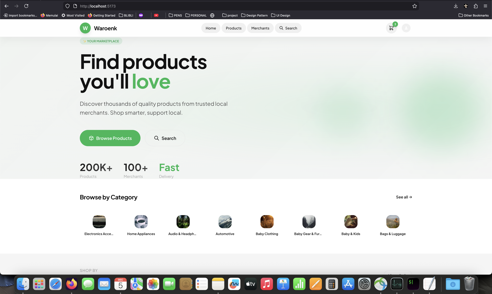
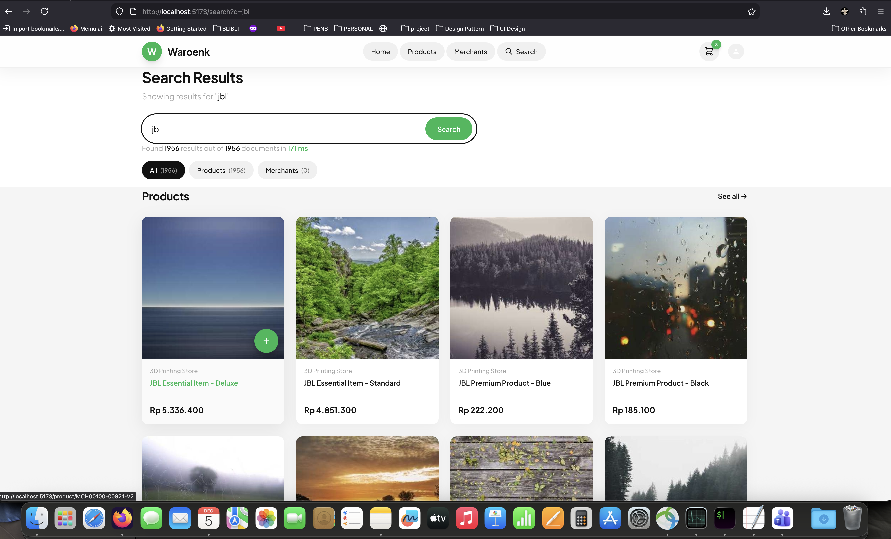
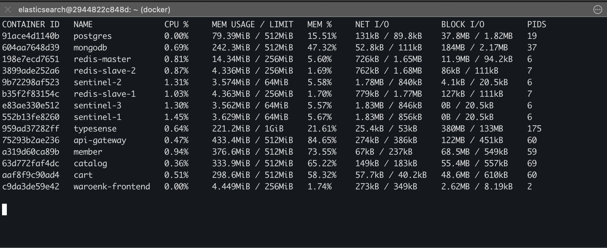
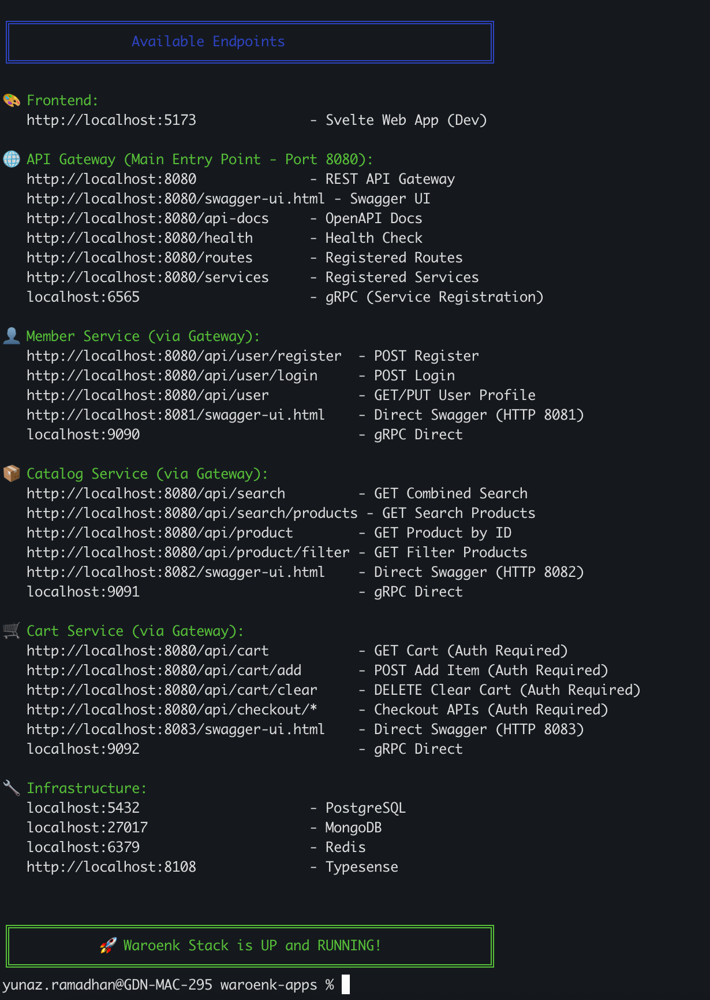

# 🛒 Waroenk

A modern e-commerce marketplace built with microservices architecture.

---

## Preview

### Homepage

*Hero section with animated gradient, category navigation, and product showcase*

### Search Results

*Fast search powered by Typesense with instant results (~171ms for 1956 products)*

### Docker Services

*All microservices running with optimized memory usage*

### Available Endpoints

*Complete API endpoint listing via `make endpoints`*

---

## Overview

Waroenk is a full-stack marketplace application featuring:

- **Product catalog** with search, filtering, and detailed product views
- **Multi-merchant** support with merchant profiles
- **User authentication** with registration and login
- **Shopping cart** and checkout flow
- **Fast search** powered by Typesense

---

## System Requirements

| Resource | Minimum | Recommended |
|----------|---------|-------------|
| **CPU** | 4 cores | 8 cores |
| **Memory** | 5 GB RAM | 8 GB RAM |
| **Storage** | 100 GB | 200 GB SSD |
| **OS** | Linux/macOS/Windows with WSL2 | Linux/macOS |

> ⚠️ **Note**: The application runs multiple Docker containers simultaneously. Ensure Docker Desktop (if used) is configured with adequate resources.

### Resource Breakdown (Actual Usage)

| Component | Memory Usage | Limit |
|-----------|--------------|-------|
| PostgreSQL | ~80 MB | 512 MB |
| MongoDB | ~242 MB | 512 MB |
| Redis (master + sentinels) | ~30 MB | 256 MB |
| Typesense | ~221 MB | 1 GB |
| API Gateway | ~433 MB | 512 MB |
| Member Service | ~377 MB | 512 MB |
| Catalog Service | ~334 MB | 512 MB |
| Cart Service | ~299 MB | 512 MB |
| Frontend (Nginx) | ~4.5 MB | 256 MB |
| **Total** | **~2 GB** | **4.5 GB** |

---

## Architecture

### Infrastructure Diagram

```
┌─────────────────────────────────────────────────────────────────────────────────┐
│                                   CLIENTS                                        │
│                        (Web Browser / Mobile App)                                │
└─────────────────────────────────┬───────────────────────────────────────────────┘
                                  │ HTTP/REST
                                  ▼
┌─────────────────────────────────────────────────────────────────────────────────┐
│                              FRONTEND LAYER                                      │
│  ┌───────────────────────────────────────────────────────────────────────────┐  │
│  │                     Svelte App + Nginx (:5173)                            │  │
│  │                                                                           │  │
│  │   • Server-side routing          • TailwindCSS styling                   │  │
│  │   • REST API client              • Svelte stores (auth, cart)            │  │
│  └───────────────────────────────────────────────────────────────────────────┘  │
└─────────────────────────────────┬───────────────────────────────────────────────┘
                                  │ HTTP/REST (/api/*)
                                  ▼
┌─────────────────────────────────────────────────────────────────────────────────┐
│                              API GATEWAY (:8080)                                 │
│  ┌───────────────────────────────────────────────────────────────────────────┐  │
│  │                         Spring Boot Gateway                               │  │
│  │                                                                           │  │
│  │   • REST → gRPC translation      • Dynamic service discovery             │  │
│  │   • Request routing              • Swagger/OpenAPI aggregation           │  │
│  │   • JWT validation               • Rate limiting & Circuit breaker       │  │
│  └───────────────────────────────────────────────────────────────────────────┘  │
└────────┬────────────────────────┬────────────────────────┬──────────────────────┘
         │ gRPC (:9090)           │ gRPC (:9091)           │ gRPC (:9092)
         ▼                        ▼                        ▼
┌─────────────────────┐  ┌─────────────────────┐  ┌─────────────────────┐
│  MEMBER SERVICE     │  │  CATALOG SERVICE    │  │  CART SERVICE       │
│  (:8081/:9090)      │  │  (:8082/:9091)      │  │  (:8083/:9092)      │
│                     │  │                     │  │                     │
│  • User auth (JWT)  │  │  • Product CRUD     │  │  • Cart management  │
│  • Registration     │  │  • Category/Brand   │  │  • Add/Remove items │
│  • Profile mgmt     │  │  • Merchant mgmt    │  │  • Checkout flow    │
│  • Address book     │  │  • Inventory sync   │  │  • Order creation   │
│  • Password reset   │  │  • Search indexing  │  │  • Price calculation│
└──────────┬──────────┘  └──────────┬──────────┘  └──────────┬──────────┘
           │                        │                        │
           ▼                        ▼                        ▼
┌─────────────────────────────────────────────────────────────────────────────────┐
│                            DATA LAYER                                            │
│                                                                                  │
│  ┌──────────────┐  ┌──────────────┐  ┌──────────────┐  ┌──────────────┐        │
│  │  PostgreSQL  │  │   MongoDB    │  │    Redis     │  │  Typesense   │        │
│  │   (:5432)    │  │   (:27017)   │  │   (:6379)    │  │   (:8108)    │        │
│  │              │  │              │  │              │  │              │        │
│  │ • Users      │  │ • Products   │  │ • Sessions   │  │ • Product    │        │
│  │ • Addresses  │  │ • Variants   │  │ • Cache      │  │   search     │        │
│  │ • Orders     │  │ • Merchants  │  │ • Rate limit │  │ • Merchant   │        │
│  │ • Carts      │  │ • Categories │  │ • Cart temp  │  │   search     │        │
│  │              │  │ • Brands     │  │              │  │ • Faceted    │        │
│  │              │  │ • Inventory  │  │              │  │   filtering  │        │
│  └──────────────┘  └──────────────┘  └──────────────┘  └──────────────┘        │
│                                                                                  │
└─────────────────────────────────────────────────────────────────────────────────┘
```

### Data Flow

```
┌──────────────────────────────────────────────────────────────────────────────┐
│                           REQUEST FLOW EXAMPLE                                │
│                         (Product Search Request)                              │
└──────────────────────────────────────────────────────────────────────────────┘

  User searches "laptop"
         │
         ▼
  ┌─────────────┐    GET /api/search?q=laptop    ┌─────────────────────┐
  │   Browser   │ ─────────────────────────────► │    API Gateway      │
  └─────────────┘                                 │    (REST)           │
         ▲                                        └──────────┬──────────┘
         │                                                   │
         │                                                   │ gRPC SearchProducts
         │                                                   ▼
         │                                        ┌─────────────────────┐
         │                                        │  Catalog Service    │
         │                                        └──────────┬──────────┘
         │                                                   │
         │                                    ┌──────────────┴──────────────┐
         │                                    ▼                             ▼
         │                           ┌─────────────┐               ┌─────────────┐
         │                           │  Typesense  │               │   MongoDB   │
         │                           │  (search)   │               │  (details)  │
         │                           └──────┬──────┘               └──────┬──────┘
         │                                  │                             │
         │                                  └──────────────┬──────────────┘
         │                                                 │
         │                                                 ▼
         │                                        ┌─────────────────────┐
         │   JSON response with products          │   Merge & Enrich    │
         └─────────────────────────────────────── │   Response          │
                                                  └─────────────────────┘
```

---

## Why Typesense over Elasticsearch?

We chose **Typesense** as our search engine instead of Elasticsearch for several key reasons:

| Aspect | Typesense | Elasticsearch |
|--------|-----------|---------------|
| **Resource Usage** | ~256 MB - 2 GB | 2 GB - 8 GB minimum |
| **Setup Complexity** | Single binary, zero config | JVM tuning, cluster setup |
| **Startup Time** | < 5 seconds | 30-60 seconds |
| **Learning Curve** | Simple REST API | Complex Query DSL |
| **Typo Tolerance** | Built-in, automatic | Requires configuration |
| **Relevance Tuning** | Sensible defaults | Manual tuning required |

### Key Benefits for Waroenk

1. **Lower Resource Footprint**
   - Typesense uses ~10x less memory than Elasticsearch
   - Critical for running full stack on developer machines (5GB RAM target)
   - Reduces cloud hosting costs significantly

2. **Developer Experience**
   - No JVM heap tuning nightmares
   - Instant startup during development
   - Simple, intuitive API

3. **Built-in Features**
   - Automatic typo correction ("laptp" → "laptop")
   - Geo-search for location-based merchant search
   - Faceted search with counts
   - Instant search (<50ms response times)

4. **Production Ready**
   - High availability with clustering support
   - Handles our 1M+ product catalog efficiently
   - Real-time indexing for inventory updates

### When to Consider Elasticsearch

- Log aggregation and analytics (ELK stack)
- Complex aggregations and analytics queries
- Existing Elasticsearch expertise on team
- Need for extensive plugin ecosystem

---

## Seed Data

The project includes pre-generated seed data for development and testing:

| Entity | Count | Description |
|--------|-------|-------------|
| **Users** | 5,000 | Test accounts with various roles |
| **Products** | 100,000 | Diverse product catalog across categories |
| **Variants** | 200,000 | Product variants (size, color, etc.) |
| **Inventory** | 200,000 | Stock records per variant |
| **Merchants** | 100 | Multi-vendor marketplace simulation |
| **Categories** | 100 | Hierarchical product categories |
| **Brands** | 1,000 | Product brands |
| **Addresses** | 10,000+ | User shipping/billing addresses |

### Seed Data Location

```
backend/waroenk-parent/catalog/src/main/resources/seed-data/
├── merchants.json      # Merchant profiles
├── categories.json     # Product categories
├── brands.json         # Brand definitions
└── README.md           # Seed data documentation
```

### Loading Seed Data

Seed data is automatically loaded on first startup when collections are empty. To reload:

```bash
# Reset and reload all data
make clean
make up
```

### Test Accounts

| Email | Password | Role |
|-------|----------|------|
| `admin@waroenk.com` | `admin123` | Admin |
| `user@waroenk.com` | `user123` | Customer |
| `merchant@waroenk.com` | `merchant123` | Merchant |

---

## Tech Stack

### Frontend
| Technology | Purpose |
|------------|---------|
| **Svelte 5** | Reactive UI framework with runes |
| **Vite** | Build tool & dev server |
| **TailwindCSS** | Utility-first styling |
| **Nginx** | Production web server with API proxy |

### Backend (Microservices)
| Service | Tech | HTTP Port | gRPC Port | Purpose |
|---------|------|-----------|-----------|---------|
| **API Gateway** | Spring Boot 3 | 8080 | 6565 | REST → gRPC routing, Swagger docs |
| **Member** | Spring Boot 3 | 8081 | 9090 | Auth, user profiles, addresses |
| **Catalog** | Spring Boot 3 | 8082 | 9091 | Products, merchants, brands, categories |
| **Cart** | Spring Boot 3 | 8083 | 9092 | Cart management, checkout |

### Infrastructure
| Service | Port | Purpose |
|---------|------|---------|
| PostgreSQL 15 | 5432 | Relational data (users, addresses, orders) |
| MongoDB 7 | 27017 | Document data (products, catalog) |
| Redis 7 | 6379 | Caching, session storage, rate limiting |
| Typesense 0.25 | 8108 | Full-text search engine |

### Communication
- **REST** → Frontend to API Gateway
- **gRPC** → Service-to-service communication (10x faster than REST)
- **Protocol Buffers** → Contract definitions in `grpc-contract/`

---

## Project Structure

```
waroenk-apps/
├── frontend/                   # Svelte web application
│   ├── src/
│   │   ├── pages/             # Route pages (Home, Products, Cart, etc.)
│   │   │   ├── Home.svelte
│   │   │   ├── Products.svelte
│   │   │   ├── ProductDetail.svelte
│   │   │   ├── Cart.svelte
│   │   │   ├── Checkout.svelte
│   │   │   └── ...
│   │   └── lib/
│   │       ├── api/           # REST API clients
│   │       │   ├── products.js
│   │       │   ├── search.js
│   │       │   ├── cart.js
│   │       │   └── auth.js
│   │       ├── components/    # Reusable UI components
│   │       │   ├── ProductCard.svelte
│   │       │   ├── MerchantCard.svelte
│   │       │   └── ...
│   │       └── stores/        # Svelte stores (auth, cart)
│   ├── Dockerfile
│   ├── nginx.conf
│   └── Makefile
│
├── backend/waroenk-parent/     # Java microservices (Maven multi-module)
│   ├── pom.xml                # Parent POM
│   ├── grpc-contract/         # Shared protobuf definitions
│   │   └── src/main/proto/
│   │       ├── catalog/       # Product, merchant, search protos
│   │       ├── member/        # User, address protos
│   │       ├── cart/          # Cart, checkout protos
│   │       └── common/        # Shared types, pagination
│   ├── api-gateway/           # REST gateway service
│   ├── member/                # User & auth service
│   ├── catalog/               # Product catalog service
│   └── cart/                  # Cart & checkout service
│
├── infra/                      # Docker infrastructure
│   ├── postgresql/
│   │   ├── docker-compose.yml
│   │   └── init-db/           # Database initialization scripts
│   ├── mongodb/
│   │   ├── docker-compose.yml
│   │   └── init-db/           # Collection setup
│   ├── redis/
│   │   └── docker-compose.yml
│   └── typesense/
│       └── docker-compose.yml
│
├── Makefile                    # Root orchestration (make up, make down, etc.)
└── README.md
```

---

## Getting Started

### Prerequisites
- Docker & Docker Compose v2+
- Make (GNU Make)
- Node.js 18+ (for frontend development)
- Java 21 (for backend development)

### Quick Start (Full Stack)

```bash
# Clone the repository
git clone <repository-url>
cd waroenk-apps

# Start everything (infra + backend + frontend)
make up

# Wait for all services to be healthy (~2-3 minutes on first run)
make status

# View all available endpoints
make endpoints
```

**Access the application:**
- 🌐 **Frontend**: http://localhost:5173
- 📚 **API Docs**: http://localhost:8080/swagger-ui.html

### Development Mode

**Frontend only:**
```bash
cd frontend
npm install
npm run dev
# → http://localhost:5173

# Backend API is proxied via vite.config.js
# Make sure backend is running: make infra && make backend
```

**Backend only:**
```bash
# Start infrastructure first
make infra

# Wait for infra to be ready
make infra-status

# Then start services (in order)
make api-gateway    # Must start first (service registry)
make member         # User service
make catalog        # Product service
make cart           # Cart service

# Or start all at once
make backend
```

### Rebuild Docker Images

```bash
# Rebuild all backend images (when code changes)
make build

# Rebuild specific service
cd backend/waroenk-parent/catalog
make build
```

---

## API Documentation

### Main Endpoints (via API Gateway - port 8080)

| Category | Endpoint | Method | Description |
|----------|----------|--------|-------------|
| **Search** | `/api/search` | GET | Combined products & merchants search |
| | `/api/search/products` | GET | Search products only |
| | `/api/search/merchants` | GET | Search merchants only |
| **Products** | `/api/product` | GET | Get product by ID |
| | `/api/product/by-sku` | GET | Get product by SKU |
| | `/api/product/details` | GET | Get verbose product details |
| | `/api/product/filter` | GET | Filter products with pagination |
| **Categories** | `/api/category` | GET | Get category by ID |
| | `/api/category/filter` | GET | List categories with pagination |
| **Brands** | `/api/brand` | GET | Get brand by ID |
| | `/api/brand/filter` | GET | List brands with pagination |
| **Merchants** | `/api/merchant` | GET | Get merchant by ID |
| | `/api/merchant/by-code` | GET | Get merchant by code |
| **Auth** | `/api/user/register` | POST | Register new user |
| | `/api/user/login` | POST | Login (returns JWT) |
| | `/api/user` | GET | Get current user profile* |
| | `/api/user` | PUT | Update user profile* |
| **Address** | `/api/address` | GET | List user addresses* |
| | `/api/address` | POST | Add new address* |
| **Cart** | `/api/cart` | GET | Get current cart* |
| | `/api/cart/add` | POST | Add item to cart* |
| | `/api/cart/update` | PUT | Update item quantity* |
| | `/api/cart/remove` | DELETE | Remove item from cart* |
| **Checkout** | `/api/checkout` | POST | Create order* |
| | `/api/checkout/history` | GET | Get order history* |

*Requires authentication (Bearer token in Authorization header)

### Swagger UI

Interactive API documentation available at:

- **Gateway (All APIs)**: http://localhost:8080/swagger-ui.html
- **Member Service**: http://localhost:8081/swagger-ui.html
- **Catalog Service**: http://localhost:8082/swagger-ui.html
- **Cart Service**: http://localhost:8083/swagger-ui.html

### Example API Calls

```bash
# Search products
curl "http://localhost:8080/api/search/products?query=laptop&size=10"

# Get product details
curl "http://localhost:8080/api/product/details?id=SKU-12345"

# Login
curl -X POST "http://localhost:8080/api/user/login" \
  -H "Content-Type: application/json" \
  -d '{"email":"user@waroenk.com","password":"user123"}'

# Add to cart (with auth token)
curl -X POST "http://localhost:8080/api/cart/add" \
  -H "Authorization: Bearer <your-jwt-token>" \
  -H "Content-Type: application/json" \
  -d '{"sku":"SKU-12345","quantity":2}'
```

---

## Useful Commands

```bash
# ═══════════════════════════════════════════
# Full Stack
# ═══════════════════════════════════════════
make up              # Start everything
make down            # Stop everything
make status          # Show service status
make endpoints       # List all endpoints
make clean           # Stop and remove all volumes

# ═══════════════════════════════════════════
# Infrastructure
# ═══════════════════════════════════════════
make infra           # Start infrastructure only
make infra-down      # Stop infrastructure
make infra-status    # Check infrastructure health

# ═══════════════════════════════════════════
# Backend Services
# ═══════════════════════════════════════════
make backend         # Start all backend services
make backend-down    # Stop all backend services
make api-gateway     # Start API Gateway only
make member          # Start Member service only
make catalog         # Start Catalog service only
make cart            # Start Cart service only

# ═══════════════════════════════════════════
# Frontend
# ═══════════════════════════════════════════
make frontend        # Build and start production frontend
make frontend-build  # Build frontend image only
make frontend-down   # Stop frontend

# ═══════════════════════════════════════════
# Logs
# ═══════════════════════════════════════════
make logs            # Aggregate all service logs
make logs-backend    # Backend logs only
make logs-infra      # Infrastructure logs only
make api-gateway-logs
make member-logs
make catalog-logs
make cart-logs
make frontend-logs

# ═══════════════════════════════════════════
# Build
# ═══════════════════════════════════════════
make build           # Rebuild all backend Docker images
```

---

## Troubleshooting

### Common Issues

**1. Services fail to start**
```bash
# Check if ports are in use
lsof -i :8080  # API Gateway
lsof -i :5432  # PostgreSQL
lsof -i :27017 # MongoDB

# Check Docker resources
docker system df
docker system prune -a  # Clean up if needed
```

**2. Out of memory**
```bash
# Check container memory usage
docker stats

# Increase Docker memory limit (Docker Desktop → Settings → Resources)
```

**3. Search not returning results**
```bash
# Check Typesense health
curl http://localhost:8108/health

# Reindex products (via Catalog service)
curl -X POST http://localhost:8082/api/internal/reindex
```

**4. Database connection issues**
```bash
# Check infrastructure status
make infra-status

# Restart infrastructure
make infra-down && make infra
```

---

## License

See [LICENSE](LICENSE) file.
