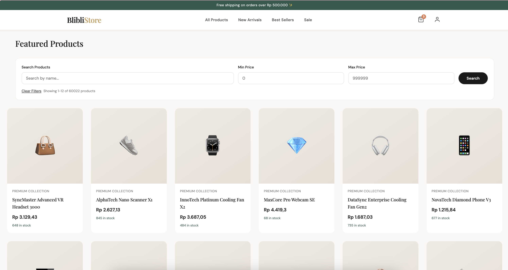

# 🛒 BlibliStore - E-Commerce Microservices Platform

<div align="center">



**A modern, scalable e-commerce platform built with Spring Boot microservices architecture**

🌐 **Live Demo:** [https://homelab.gosoft.web.id/ecommurz/](https://homelab.gosoft.web.id/ecommurz/)

[](https://openjdk.org/)
[](https://spring.io/projects/spring-boot)
[](https://www.docker.com/)
[](LICENSE)

</div>

---

## 📋 Table of Contents

- [Overview](#-overview)
- [Live Demo](#-live-demo)
- [Architecture](#-architecture)
- [Features](#-features)
- [Tech Stack](#-tech-stack)
- [Services](#-services)
- [Getting Started](#-getting-started)
- [Docker Deployment](#-docker-deployment)
- [API Documentation](#-api-documentation)
- [Performance Testing](#-performance-testing)
- [Monitoring](#-monitoring)
- [Project Structure](#-project-structure)
- [Contributing](#-contributing)
- [License](#-license)

---

## 🎯 Overview

BlibliStore is a comprehensive e-commerce platform designed with microservices architecture principles. The platform provides a complete shopping experience including product browsing, user authentication, shopping cart management, and order processing.

### Key Highlights

- 🏗️ **Microservices Architecture** - Independently deployable services
- 🔐 **JWT Authentication** - Secure token-based authentication
- 🌐 **API Gateway** - Centralized routing and authentication
- 📊 **Real-time Monitoring** - JavaMelody & Spring Actuator integration
- 🐳 **Docker Ready** - Containerized deployment support
- 🧪 **Comprehensive Testing** - Unit tests with JUnit 5 & Mockito

---

## 🌐 Live Demo

Experience the platform live at: **[https://homelab.gosoft.web.id/ecommurz/](https://homelab.gosoft.web.id/ecommurz/)**

### Demo Features Available:
- 🔍 Browse 60,000+ products
- 🔎 Search products by name with price filtering
- 👤 User registration and login
- 🛒 Add products to cart
- 💳 Checkout process
- 📱 Responsive design for all devices

---

## 🏗️ Architecture

```
┌─────────────────────────────────────────────────────────────────┐
│                         CLIENT (Browser)                        │
│                    https://homelab.gosoft.web.id                │
└─────────────────────────────────────────────────────────────────┘
                                  │
                                  ▼
┌─────────────────────────────────────────────────────────────────┐
│                      API GATEWAY (Port 7070)                    │
│              Spring Cloud Gateway + JWT Authentication          │
│                   Route: /member/**, /product-service/**,       │
│                          /cart/**                               │
└─────────────────────────────────────────────────────────────────┘
                    │                │                │
         ┌──────────┘                │                └──────────┐
         ▼                           ▼                           ▼
┌─────────────────┐      ┌─────────────────┐      ┌─────────────────┐
│  MEMBER SERVICE │      │ PRODUCT SERVICE │      │  CART SERVICE   │
│   (Port 8081)   │      │   (Port 8082)   │      │   (Port 8083)   │
│                 │      │                 │      │                 │
│ • Registration  │      │ • Product CRUD  │      │ • Cart Mgmt     │
│ • Login/Logout  │      │ • Search        │      │ • Add/Remove    │
│ • JWT Tokens    │      │ • Pagination    │      │ • Checkout      │
└────────┬────────┘      └────────┬────────┘      └────────┬────────┘
         │                        │                        │
         ▼                        ▼                        ▼
┌─────────────────┐      ┌─────────────────┐      ┌─────────────────┐
│   PostgreSQL    │      │    MongoDB      │      │   PostgreSQL    │
│   (member DB)   │      │   (product DB)  │      │    (order DB)   │
└─────────────────┘      └─────────────────┘      └─────────────────┘
```

---

## ✨ Features

### 🛍️ E-Commerce Features

| Feature | Description |
|---------|-------------|
| **Product Catalog** | Browse 60,000+ products with images and descriptions |
| **Advanced Search** | Search by name with min/max price filtering |
| **Pagination** | Efficient browsing with paginated results |
| **Shopping Cart** | Add, update, remove items from cart |
| **User Accounts** | Registration, login, and profile management |
| **Responsive UI** | Beautiful, modern design that works on all devices |

### 🔐 Security Features

| Feature | Description |
|---------|-------------|
| **JWT Authentication** | Secure token-based authentication |
| **Password Encryption** | BCrypt password hashing |
| **API Gateway Security** | Centralized authentication filter |
| **CORS Configuration** | Cross-origin request handling |

### 📊 Monitoring & Observability

| Feature | Description |
|---------|-------------|
| **JavaMelody** | Application performance monitoring |
| **Spring Actuator** | Health checks and metrics endpoints |
| **Prometheus Metrics** | Metrics export for monitoring systems |
| **Custom Dashboard** | Real-time monitoring visualization |

---

## 🛠️ Tech Stack

### Backend
| Technology | Version | Purpose |
|------------|---------|---------|
| Java | 21 | Programming Language |
| Spring Boot | 3.5.8 | Application Framework |
| Spring Cloud Gateway | 2025.0.0 | API Gateway |
| Spring Data JPA | 3.5.8 | Database ORM |
| Spring Data MongoDB | 3.5.8 | MongoDB Integration |
| Spring Security | 3.5.8 | Authentication & Authorization |

### Databases
| Database | Purpose |
|----------|---------|
| PostgreSQL | Member & Order data storage |
| MongoDB | Product catalog storage |

### DevOps & Tools
| Tool | Purpose |
|------|---------|
| Docker | Containerization |
| Maven | Build & Dependency Management |
| JMeter | Performance Testing |
| JavaMelody | Application Monitoring |
| Swagger/OpenAPI | API Documentation |

### Frontend
| Technology | Purpose |
|------------|---------|
| HTML5/CSS3 | Structure & Styling |
| JavaScript | Client-side Logic |
| Chart.js | Monitoring Visualizations |

---

## 📦 Services

### 1. API Gateway (`api-gateway`)
**Port:** 7070

The central entry point for all client requests.

- **Routing:** Routes requests to appropriate microservices
- **Authentication:** JWT token validation
- **CORS:** Cross-origin request handling
- **Rate Limiting:** Request throttling (configurable)

**Routes:**
| Route Pattern | Target Service |
|--------------|----------------|
| `/member/**` | Member Service |
| `/product-service/**` | Product Service |
| `/cart/**` | Cart Service |

---

### 2. Member Service (`member`)
**Port:** 8081 | **Context Path:** `/member`

Handles user authentication and management.

**Endpoints:**
| Method | Endpoint | Description | Auth |
|--------|----------|-------------|------|
| POST | `/register` | User registration | ❌ |
| POST | `/login` | User login (returns JWT) | ❌ |
| POST | `/logout` | User logout | ✅ |
| GET | `/hello` | Health check | ❌ |

**Database:** PostgreSQL (`member` database)

---

### 3. Product Service (`product`)
**Port:** 8082 | **Context Path:** `/product-service`

Manages the product catalog.

**Endpoints:**
| Method | Endpoint | Description | Auth |
|--------|----------|-------------|------|
| GET | `/products` | List all products (paginated) | ❌ |
| GET | `/products/{id}` | Get product by ID | ❌ |
| POST | `/products` | Create new product | ✅ |
| PUT | `/products/{id}` | Update product | ✅ |
| DELETE | `/products/{id}` | Delete product | ✅ |
| POST | `/products/search` | Search products | ❌ |

**Database:** MongoDB (`product` database)

---

### 4. Cart Service (`cart`)
**Port:** 8083

Manages shopping cart operations.

**Endpoints:**
| Method | Endpoint | Description | Auth |
|--------|----------|-------------|------|
| GET | `/carts` | Get user's cart | ✅ |
| POST | `/carts` | Add item to cart | ✅ |
| PUT | `/carts/{id}` | Update cart item | ✅ |
| DELETE | `/carts/{id}` | Remove from cart | ✅ |
| DELETE | `/carts` | Clear cart | ✅ |

**Database:** PostgreSQL (`order` database)

---

### 5. Generic Framework (`generic-framework`)
Shared library containing common utilities.

**Components:**
- `BaseResponse` - Standard API response wrapper
- `JwtUtils` - JWT token utilities
- `AuthenticationException` - Custom exception handling
- Common configurations and constants

---

## 🚀 Getting Started

### Prerequisites

- Java 21+
- Maven 3.8+
- Docker & Docker Compose (for containerized deployment)
- PostgreSQL 16+
- MongoDB 7+

### Local Development

1. **Clone the repository**
   ```bash
   git clone <repository-url>
   cd final-project
   ```

2. **Build the generic framework first**
   ```bash
   cd generic-framework
   mvn clean install -DskipTests
   cd ..
   ```

3. **Start each service**
   ```bash
   # Terminal 1 - Member Service
   cd member && mvn spring-boot:run

   # Terminal 2 - Product Service
   cd product && mvn spring-boot:run

   # Terminal 3 - Cart Service
   cd cart && mvn spring-boot:run

   # Terminal 4 - API Gateway
   cd api-gateway && mvn spring-boot:run
   ```

4. **Access the application**
   - API Gateway: http://localhost:7070
   - Member Service: http://localhost:8081/member
   - Product Service: http://localhost:8082/product-service
   - Cart Service: http://localhost:8083

---

## 🐳 Docker Deployment

### Quick Start with Docker Compose

```bash
# Build and start all services
docker-compose up --build

# Run in detached mode
docker-compose up -d --build

# View logs
docker-compose logs -f

# Stop all services
docker-compose down
```

### Service Ports in Docker

| Service | Port | URL |
|---------|------|-----|
| API Gateway | 7070 | http://localhost:7070 |
| Member Service | 8081 | http://localhost:8081/member |
| Product Service | 8082 | http://localhost:8082/product-service |
| Cart Service | 8083 | http://localhost:8083 |

### Docker Compose Files

| File | Description |
|------|-------------|
| `docker-compose.yml` | Uses external databases |

---

## 📚 API Documentation

### Swagger UI Access

Each service exposes Swagger documentation:

| Service | Swagger URL |
|---------|-------------|
| Member | http://localhost:8081/member/swagger-ui.html |
| Product | http://localhost:8082/product-service/swagger-ui.html |
| Cart | http://localhost:8083/swagger-ui.html |

### Sample API Requests

#### Register User
```bash
curl -X POST http://localhost:7070/member/register \
  -H "Content-Type: application/json" \
  -d '{
    "email": "user@example.com",
    "password": "password123"
  }'
```

#### Login
```bash
curl -X POST http://localhost:7070/member/login \
  -H "Content-Type: application/json" \
  -d '{
    "email": "user@example.com",
    "password": "password123"
  }'
```

#### Get Products
```bash
curl -X GET "http://localhost:7070/product-service/products?page=0&size=10"
```

#### Add to Cart (Authenticated)
```bash
curl -X POST http://localhost:7070/cart/carts \
  -H "Content-Type: application/json" \
  -H "Authorization: Bearer <your-jwt-token>" \
  -d '{
    "productId": "PRD-001",
    "quantity": 2
  }'
```

---

## 🧪 Performance Testing

### JMeter Test Scripts

The project includes JMeter test scripts for performance testing:

| Script | Description |
|--------|-------------|
| `data-generator.jmx` | Generates 50,000 products and 5,000 members |
| `e2e-user-journey.jmx` | End-to-end user journey test |

### Performance Results

#### Member Registration (via Gateway)


| Metric | Value |
|--------|-------|
| Samples | 5,000 |
| Average | 1,815ms |
| Median | 970ms |
| 90% Line | 3,789ms |
| 95% Line | 7,443ms |
| Throughput | 26.5/sec |
| Error % | 0.00% |

#### Product Creation


| Metric | Value |
|--------|-------|
| Samples | 50,000 |
| Average | 148ms |
| Throughput | 548.6/sec |
| Error % | 0.00% |

### Running Performance Tests

```bash
# Using JMeter GUI
jmeter -t data-generator.jmx

# Using JMeter CLI (non-GUI)
jmeter -n -t e2e-user-journey.jmx -l results.jtl -e -o report/
```

---

## 📊 Monitoring

### JavaMelody Monitoring

Access monitoring for each service:

| Service | Monitoring URL |
|---------|----------------|
| Member | http://localhost:8081/member/monitoring |
| Product | http://localhost:8082/product-service/monitoring |
| Cart | http://localhost:8083/monitoring |

### Spring Actuator Endpoints

| Endpoint | Description |
|----------|-------------|
| `/actuator/health` | Service health status |
| `/actuator/metrics` | Application metrics |
| `/actuator/prometheus` | Prometheus-format metrics |
| `/actuator/info` | Application info |

### Custom Monitoring Dashboard

The `public-ui/monitoring.html` provides a visual dashboard showing:
- CPU Usage
- Memory Utilization
- Request Statistics
- Real-time Charts

### Infrastructure Monitoring


Container resource utilization:
| Container | CPU % | Memory |
|-----------|-------|--------|
| postgres-db | 0.48% | 85.56 MiB |
| mongo-db | 0.68% | 171 MiB |
| redis-server | 0.10% | 20.63 MiB |
| kafka | 0.36% | 361.1 MiB |
| zookeeper | 0.11% | 135.1 MiB |

---

## 📁 Project Structure

```
final-project/
├── api-gateway/              # API Gateway service
│   ├── src/main/java/
│   │   └── com/blibli/training/gateway/
│   │       ├── config/       # Configuration classes
│   │       ├── filter/       # Authentication filter
│   │       └── GatewayApplication.java
│   ├── src/main/resources/
│   │   ├── application.yml
│   │   └── application-docker.yml
│   └── Dockerfile
│
├── member/                   # Member service
│   ├── src/main/java/
│   │   └── com/blibli/training/member/
│   │       ├── config/       # Security configuration
│   │       ├── controller/   # REST controllers
│   │       ├── dto/          # Data transfer objects
│   │       ├── entity/       # JPA entities
│   │       ├── repository/   # Data repositories
│   │       └── service/      # Business logic
│   └── Dockerfile
│
├── product/                  # Product service
│   ├── src/main/java/
│   │   └── com/blibli/training/product/
│   │       ├── controller/   # REST controllers
│   │       ├── entity/       # MongoDB documents
│   │       ├── model/        # Request/Response models
│   │       ├── repository/   # MongoDB repositories
│   │       └── service/      # Business logic
│   └── Dockerfile
│
├── cart/                     # Cart service
│   ├── src/main/java/
│   │   └── com/blibli/training/cart/
│   │       ├── controller/   # REST controllers
│   │       ├── entity/       # JPA entities
│   │       ├── repository/   # Data repositories
│   │       └── service/      # Business logic
│   └── Dockerfile
│
├── generic-framework/        # Shared library
│   └── src/main/java/
│       └── com/blibli/training/framework/
│           ├── configurations/
│           ├── constant/
│           ├── dto/
│           ├── exception/
│           └── security/
│
├── public-ui/                # Static frontend files
│   ├── index.html           # Main e-commerce UI
│   └── monitoring.html      # Monitoring dashboard
│
├── readme/                   # Documentation images
│   ├── website-template.png
│   ├── performance-test-on-register-via-gateway.png
│   ├── performance-test-on-create-product.png
│   └── memory-usage-utility.png
│
├── docker-compose.yml        # Docker orchestration
├── data-generator.jmx        # JMeter data generation script
├── e2e-user-journey.jmx      # JMeter E2E test script
├── .dockerignore
└── README.md
```

---

## 🤝 Contributing

1. Fork the repository
2. Create your feature branch (`git checkout -b feature/AmazingFeature`)
3. Commit your changes (`git commit -m 'Add some AmazingFeature'`)
4. Push to the branch (`git push origin feature/AmazingFeature`)
5. Open a Pull Request

---

## 📄 License

This project is licensed under the MIT License - see the [LICENSE](LICENSE) file for details.

---

## 👤 Author

**Blibli Training Team**

---

<div align="center">

**⭐ Star this repository if you find it helpful!**

Made with ❤️ using Spring Boot

</div>
