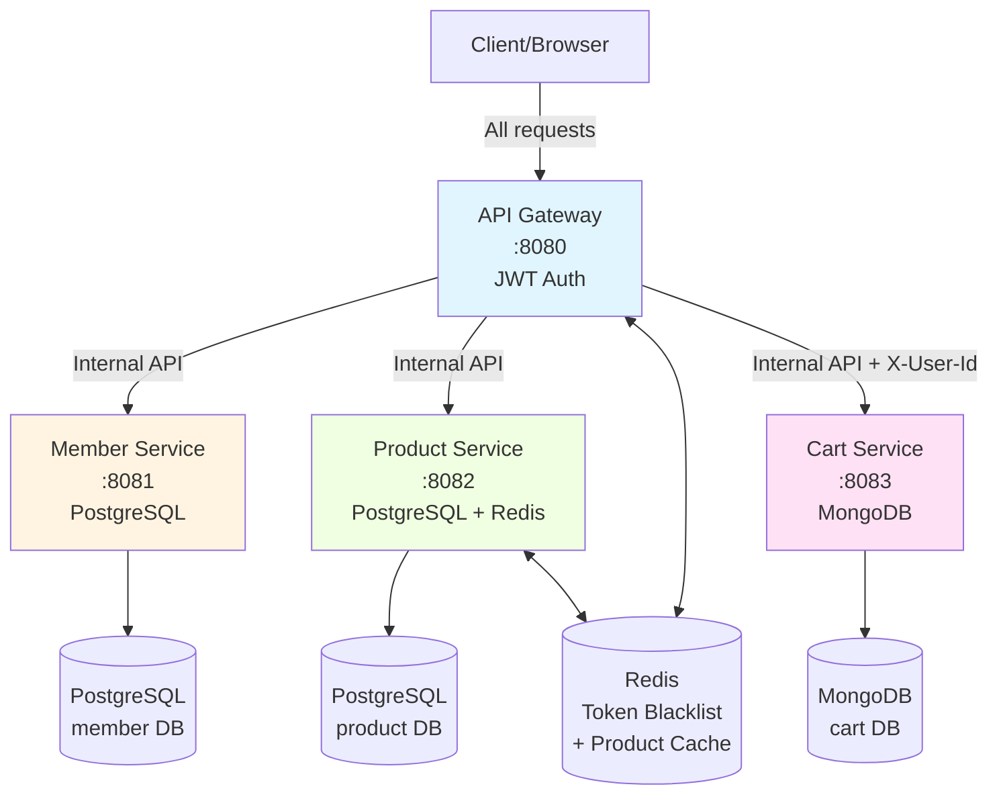

# Training Project 2025-11 - Microservices E-Commerce Platform

## Overview
A microservices-based e-commerce platform built with Spring Boot 3.5.8, demonstrating modern cloud-native architecture patterns including API Gateway, JWT authentication, distributed caching, and polyglot persistence.

## Architecture



### Services

| Service | Port | Database | Purpose | Security |
|---------|------|----------|---------|----------|
| **API Gateway** | 8080 | Redis (cache) | Entry point, JWT validation, routing | JWT filter on all routes |
| **Member Service** | 8081 | PostgreSQL | User registration & credential validation | No security (internal only) |
| **Product Service** | 8082 | PostgreSQL + Redis | Product catalog with caching | No security (internal only) |
| **Cart Service** | 8083 | MongoDB | Shopping cart management | No security (internal only) |

### Security Architecture

> [!IMPORTANT]
> **Gateway-Only Security Pattern**: Only the API Gateway has Spring Security enabled. Backend services (Member, Product, Cart) have no authentication layers, relying on network isolation and trusting requests from the Gateway.

- **Authentication**: JWT tokens issued by Gateway after credential validation via Member Service
- **Authorization**: JWT filter in Gateway validates tokens and extracts user info
- **User Propagation**: Gateway adds `X-User-Id` header to downstream requests
- **Token Storage**: HttpOnly cookies (secure, no XSS risk)
- **Logout**: Token blacklist in Redis (15-minute TTL)

## Tech Stack

- **Java 21** with Spring Boot 3.5.8
- **Databases**: 
  - PostgreSQL 12+ (Member, Product)
  - MongoDB 4.4+ (Cart)
  - Redis 6+ (Token blacklist + Product cache)
- **Security**: JWT with HttpOnly cookies
- **Build Tool**: Maven 3.9.11 (with wrapper included)
- **Documentation**: OpenAPI/Swagger UI

## Quick Start

### 1. Prerequisites

- **Java 21+** (JDK must be installed)
- **PostgreSQL 12+** (running on default port 5432)
- **MongoDB 4.4+** (running on default port 27017)
- **Redis 6+** (running on default port 6379)

> [!TIP]
> **No Maven installation required!** Each service includes Maven wrapper (`mvnw` / `mvnw.cmd`).

### 2. Database Setup

#### PostgreSQL Setup

Create databases and users:
```sql
CREATE DATABASE member;
CREATE USER member_user WITH ENCRYPTED PASSWORD 'member_pass';
GRANT ALL PRIVILEGES ON DATABASE member TO member_user;

CREATE DATABASE product;
CREATE USER product_user WITH ENCRYPTED PASSWORD 'product_pass';
GRANT ALL PRIVILEGES ON DATABASE product TO product_user;
```

Enable pgcrypto extension (for UUID generation):
```sql
\c member
CREATE EXTENSION IF NOT EXISTS "pgcrypto";

\c product
CREATE EXTENSION IF NOT EXISTS "pgcrypto";
```

Seed databases:
```bash
psql -U postgres -d member -f member/setup-db.sql
psql -U postgres -d product -f product/setup-db.sql
```

This generates:
- **5,000 members** with MD5-hashed passwords (format: `user{1..5000}@example.com` / password: `password`)
- **50,000 products** with random names and prices

#### MongoDB Setup

MongoDB will auto-create the `cart` database on first connection. No setup needed.

#### Redis Setup

Redis should be running with default configuration. No setup needed.

### 3. Start Services

> [!WARNING]
> **Start order matters!** Start backend services first, then Gateway last.

Open 4 separate terminals and run:

```bash
# Terminal 1 - Member Service
cd member
./mvnw spring-boot:run

# Terminal 2 - Product Service
cd product
./mvnw spring-boot:run

# Terminal 3 - Cart Service
cd cart
./mvnw spring-boot:run

# Terminal 4 - API Gateway (start last!)
cd api-gateway
./mvnw spring-boot:run
```

Windows users use `mvnw.cmd` instead of `./mvnw`.

### 4. Verify Services

Check health:
```bash
curl http://localhost:8080/actuator/health  # Gateway
curl http://localhost:8081/members/actuator/health  # Member
curl http://localhost:8082/products/actuator/health  # Product
curl http://localhost:8083/cart/actuator/health  # Cart
```

### 5. Access Swagger Documentation

- Gateway API: http://localhost:8080/swagger-ui.html
- Member Service: http://localhost:8081/members/swagger-ui.html
- Product Service: http://localhost:8082/products/swagger-ui.html
- Cart Service: http://localhost:8083/cart/swagger-ui.html

## API Endpoints

### Authentication (Public)

```http
POST http://localhost:8080/auth/register
Content-Type: application/json

{
  "name": "John Doe",
  "email": "john@example.com",
  "password": "password123"
}
```

```http
POST http://localhost:8080/auth/login
Content-Type: application/json

{
  "email": "john@example.com",
  "password": "password123"
}

Response: Sets HttpOnly cookie + returns JWT in body
```

```http
POST http://localhost:8080/auth/logout
Cookie: jwt_token=<your-token>

Response: Clears cookie + blacklists token
```

### Products (Public)

```http
# Search products
GET http://localhost:8080/products?query=laptop&page=0&size=20

# Get product details (cached in Redis)
GET http://localhost:8080/products/123e4567-e89b-12d3-a456-426614174000
```

### Cart (Protected - Requires Authentication)

```http
# View cart
GET http://localhost:8080/cart
Cookie: jwt_token=<your-token>

# Add item to cart
POST http://localhost:8080/cart
Cookie: jwt_token=<your-token>
Content-Type: application/json

{
  "productId": "123e4567-e89b-12d3-a456-426614174000",
  "quantity": 2
}

# Remove item from cart
DELETE http://localhost:8080/cart/123e4567-e89b-12d3-a456-426614174000
Cookie: jwt_token=<your-token>
```

## Features Implemented

✅ **Authentication & Authorization**
- User registration with password hashing (MD5 for training purposes)
- JWT-based authentication with HttpOnly cookies
- Logout with Redis-backed token blacklist (15-min TTL)
- Gateway-level authorization via JWT filter

✅ **Product Catalog**
- Product search with wildcard support (`LIKE %query%`)
- Pagination for product listing
- Redis cache for product detail lookups (10-min TTL)

✅ **Shopping Cart**
- Per-user cart management (MongoDB)
- Add, view, remove items
- User ID propagation via `X-User-Id` header from Gateway

✅ **Microservices Patterns**
- API Gateway pattern (centralized routing)
- Gateway-only security (network isolation for backends)
- Polyglot persistence (PostgreSQL, MongoDB, Redis)
- Service-to-service communication via RestTemplate
- Distributed caching with Redis

✅ **Developer Experience**
- Maven wrapper included (no Maven installation needed)
- OpenAPI/Swagger documentation for all services
- Structured logging with SLF4J
- Actuator endpoints for monitoring

## Project Structure

```
training-project-2025-11/
├── api-gateway/          # API Gateway (JWT, routing)
│   ├── .mvn/            # Maven wrapper files
│   ├── mvnw, mvnw.cmd   # Maven wrapper scripts
│   └── src/
├── member/               # Member service (PostgreSQL)
│   ├── .mvn/
│   ├── mvnw, mvnw.cmd
│   ├── setup-db.sql     # Database seed script
│   └── src/
├── product/              # Product service (PostgreSQL + Redis)
│   ├── .mvn/
│   ├── mvnw, mvnw.cmd
│   ├── setup-db.sql
│   └── src/
├── cart/                 # Cart service (MongoDB)
│   ├── .mvn/
│   ├── mvnw, mvnw.cmd
│   └── src/
├── common-model/         # Shared DTOs and models
│   └── src/
└── README.md
```

## Development

### Build All Services

From each service directory:
```bash
./mvnw clean install
```

### Run Tests

```bash
./mvnw test
```

### Configuration Files

Each service has `application.properties` in `src/main/resources/`:

- **Database connections** (JDBC URLs, credentials)
- **Server ports** and context paths
- **JWT secret** (in Gateway only)
- **Redis connection** (Gateway & Product)
- **Client URLs** (for inter-service communication)

### Common Issues

**Issue**: "Cannot connect to database"
- **Solution**: Ensure PostgreSQL/MongoDB/Redis are running and credentials match `application.properties`

**Issue**: "401 Unauthorized" on registration
- **Solution**: Ensure Member Service is running and accessible from Gateway

**Issue**: "BeanCreationException: PasswordEncoder"
- **Solution**: Member Service now uses custom PasswordEncoder (no Spring Security dependency)

**Issue**: Maven wrapper not executing
- **Solution**: On Unix/Mac, run `chmod +x mvnw` first

## Security Considerations

> [!CAUTION]
> **For Production Use**: This is a training project. Before deploying to production:
> - Replace MD5 password hashing with BCrypt (add Spring Security to Member Service or use standalone BCrypt library)
> - Use strong JWT secrets (not hardcoded in application.properties)
> - Implement mTLS between Gateway and backend services
> - Add rate limiting and request validation
> - Use service mesh (Istio, Linkerd) for secure service-to-service communication
> - Implement proper secret management (Vault, AWS Secrets Manager)

## License

MIT
