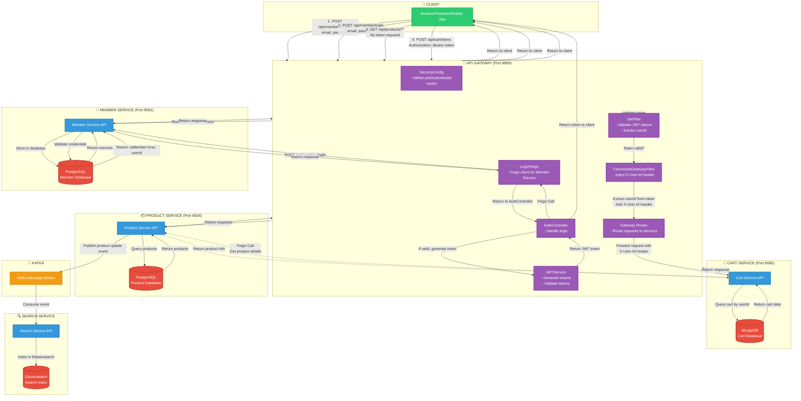
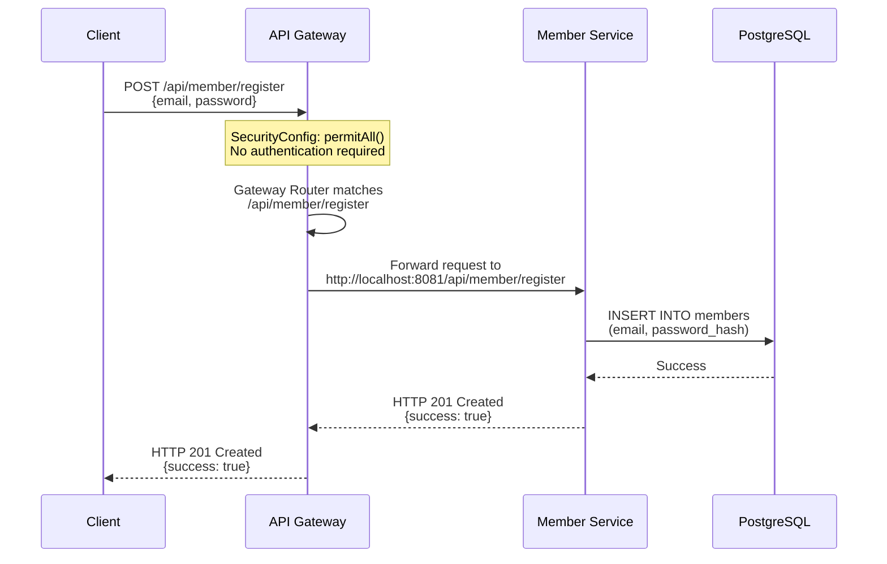
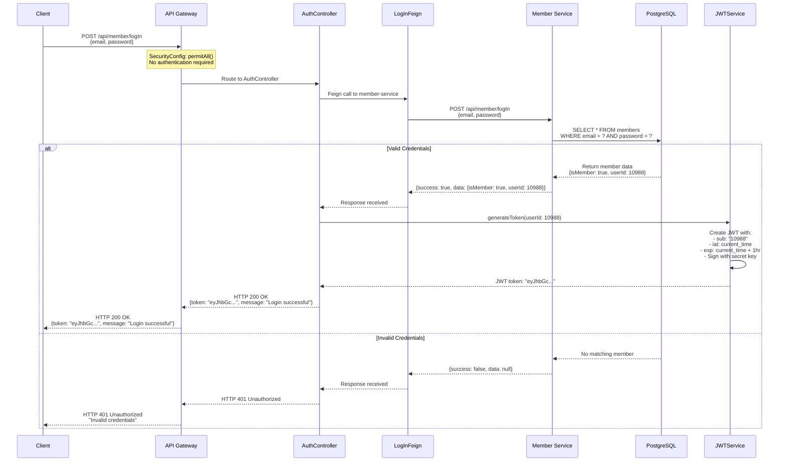
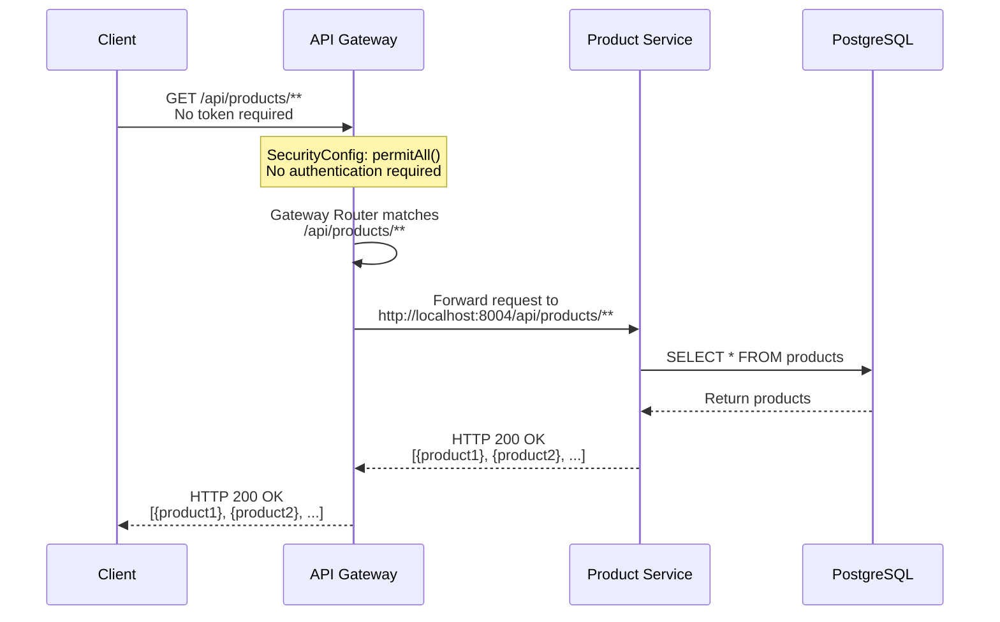
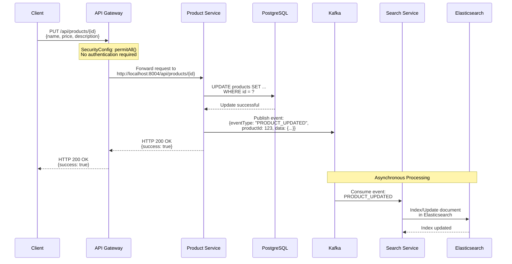
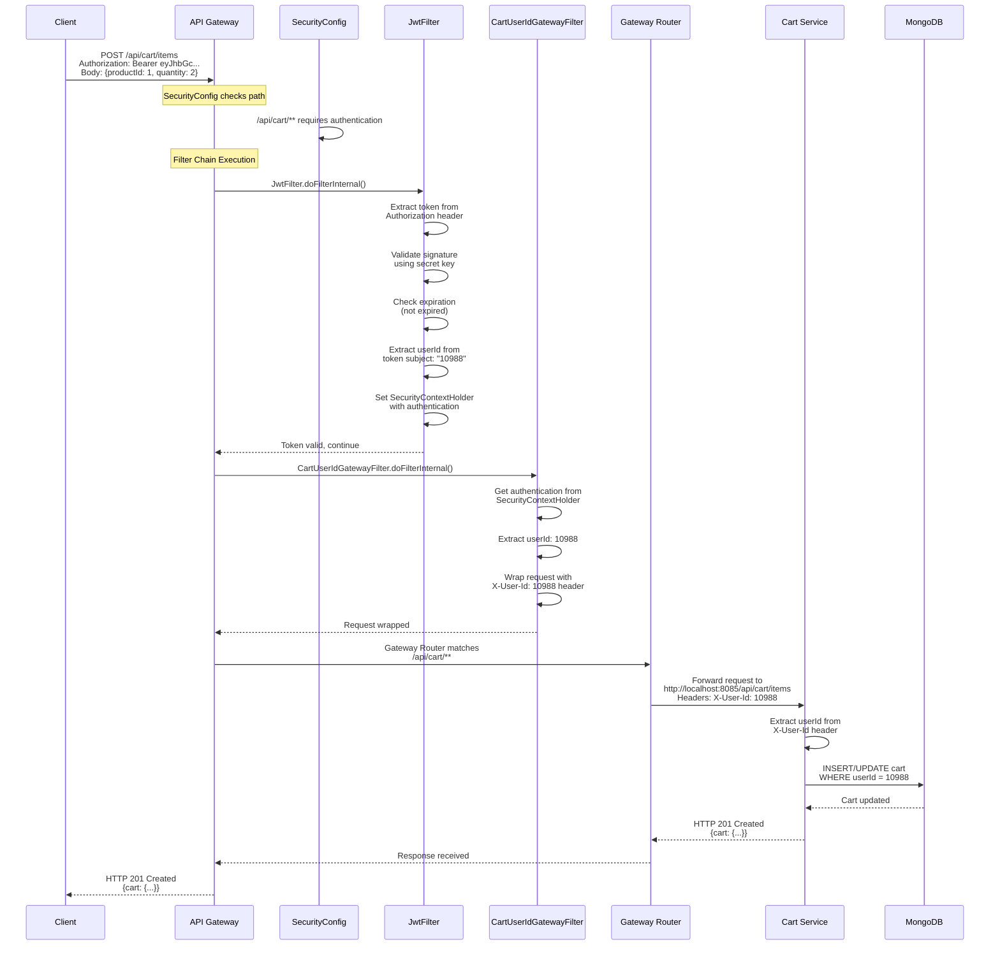
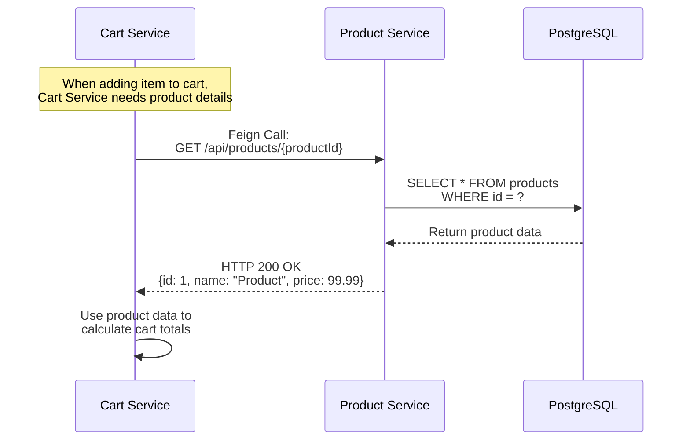

# Microservices Architecture Diagram

## Complete System Architecture



## Detailed Flow Diagrams

### 1. Registration Flow



### 2. Login Flow



### 3. Product Access Flow



### 4. Product Update & Search Indexing Flow



### 5. Cart Access Flow (Authenticated)



### 6. Cart to Product Feign Call Flow



## Component Details

### API Gateway Components

| Component | Purpose | Key Methods |
|-----------|---------|-------------|
| **SecurityConfig** | Configures Spring Security, defines public/protected routes, sets up filter chain | `securityFilterChain()` |
| **JwtFilter** | Validates JWT tokens, extracts userId, sets authentication context | `doFilterInternal()`, `shouldNotFilter()` |
| **CartUserIdGatewayFilter** | Extracts userId from JWT and injects X-User-Id header for cart requests | `doFilterInternal()`, `shouldNotFilter()` |
| **AuthController** | Handles login requests, calls member-service via Feign, generates JWT tokens | `login()` |
| **LogInFeign** | Feign client interface for calling member-service login endpoint | `logIn()` |
| **JWTService** | Generates and validates JWT tokens, extracts claims | `generateToken()`, `extractUserId()`, `isTokenExpired()` |
| **Gateway Router** | Routes requests to appropriate microservices based on path patterns | Configured in `application.properties` |

### Service Ports

- **API Gateway**: 8999
- **Member Service**: 8081
- **Product Service**: 8004
- **Cart Service**: 8085

### Database Technologies

- **Member Service**: PostgreSQL
- **Product Service**: PostgreSQL
- **Cart Service**: MongoDB
- **Search Service**: Elasticsearch

### Communication Patterns

1. **Synchronous HTTP**: Gateway to services, Cart to Product (Feign)
2. **Asynchronous Messaging**: Product to Search via Kafka
3. **Stateless Authentication**: JWT tokens, no server-side sessions

## Security Flow Summary

```
┌─────────────────────────────────────────────────────────────┐
│                    REQUEST CLASSIFICATION                    │
└─────────────────────────────────────────────────────────────┘
                              │
                ┌─────────────┴─────────────┐
                │                           │
        ┌───────▼───────┐         ┌─────────▼─────────┐
        │  PUBLIC PATH  │         │  PROTECTED PATH   │
        │               │         │                   │
        │ - /register   │         │ - /api/cart/**    │
        │ - /logIn      │         │                   │
        │ - /products/**│         │ Requires:          │
        │               │         │ - JWT Token        │
        │ No auth needed│         │ - Valid signature │
        │               │         │ - Not expired     │
        └───────┬───────┘         │ - userId extracted│
                │                 └─────────┬─────────┘
                │                           │
                │                 ┌─────────▼─────────┐
                │                 │   JwtFilter       │
                │                 │ - Validate token  │
                │                 │ - Set auth context│
                │                 └─────────┬─────────┘
                │                           │
                │                 ┌─────────▼─────────┐
                │                 │CartUserIdGateway  │
                │                 │Filter (cart only) │
                │                 │ - Extract userId  │
                │                 │ - Add X-User-Id   │
                │                 └─────────┬─────────┘
                │                           │
                └───────────┬───────────────┘
                            │
                    ┌───────▼───────┐
                    │ Route to      │
                    │ Microservice  │
                    └───────────────┘
```

## Key Design Decisions

1. **Stateless Authentication**: JWT tokens eliminate need for server-side sessions
2. **Gateway as Single Entry Point**: All client requests go through gateway
3. **Service-Specific Databases**: Each service has its own database (polyglot persistence)
4. **Event-Driven Updates**: Product changes propagated to Search via Kafka
5. **Header-Based User Context**: Cart service receives userId via X-User-Id header
6. **Feign for Inter-Service Communication**: Declarative HTTP client for synchronous calls


